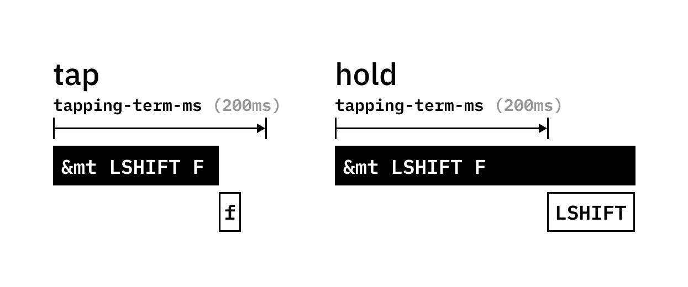
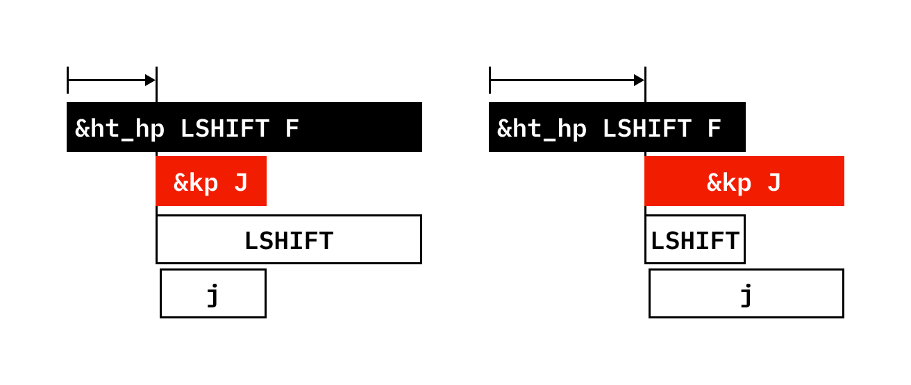
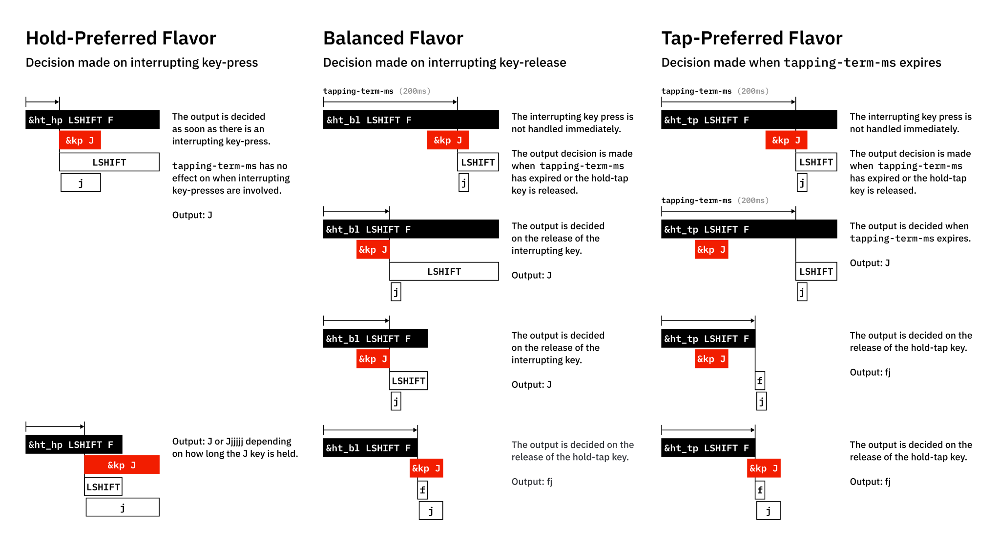

import Tabs from '@theme/Tabs';
import TabItem from '@theme/TabItem';

## Summary

Hold-tap is the basis for other behaviors such as layer-tap and mod-tap.

Simply put, the hold-tap key will output the 'hold' behavior if it's held for a while, and output the 'tap' behavior when it's tapped quickly.

### Hold-Tap

The graph below shows how the hold-tap decides between a 'tap' and a 'hold'.



By default, the hold-tap is configured to also select the 'hold' functionality if another key is tapped while it's active:



We call this the 'hold-preferred' flavor of hold-taps. While this flavor may work very well for a ctrl/escape key, it's not very well suited for home-row mods or layer-taps. That's why there are two more flavors to choose from: 'tap-preferred' and 'balanced'.

#### Flavors

- The 'hold-preferred' flavor triggers the hold behavior when the `tapping-term-ms` has expired or another key is pressed.
- The 'balanced' flavor will trigger the hold behavior when the `tapping-term-ms` has expired or another key is pressed and released.
- The 'tap-preferred' flavor triggers the hold behavior when the `tapping-term-ms` has expired. It triggers the tap behavior when another key is pressed.
- The 'tap-unless-interrupted' flavor triggers a hold behavior only when another key is pressed before `tapping-term-ms` has expired. It triggers the tap behavior in all other situations.

When the hold-tap key is released and the hold behavior has not been triggered, the tap behavior will trigger.



### Basic usage

For basic usage, please see the [mod-tap](mod-tap.md) and [layer-tap](layers.md#layer-tap) pages.

### Advanced Configuration

#### `tapping-term-ms`

Defines how long a key must be pressed to trigger Hold behavior.

#### `quick-tap-ms`

If you press a tapped hold-tap again within `quick-tap-ms` milliseconds, it will always trigger the tap behavior. This is useful for things like a backspace, where a quick tap+hold holds backspace pressed. Set this to a negative value to disable. The default is -1 (disabled).

In QMK, unlike ZMK, this functionality is enabled by default, and you turn it off using `TAPPING_FORCE_HOLD`.

#### `global-quick-tap`

If `global-quick-tap` is enabled, then `quick-tap-ms` will apply not only when the given hold-tap is tapped, but for any key tapped before it. This effectively disables the hold-tap when typing quickly, which can be quite useful for homerow mods. It can also have the effect of removing the input delay when typing quickly.

For example, the following hold-tap configuration enables `global-quick-tap` with a 125 millisecond `quick-tap-ms` term.

```
gqt: global-quick-tap {
	compatible = "zmk,behavior-hold-tap";
	label = "GLOBAL_QUICK_TAP";
	#binding-cells = <2>;
	flavor = "tap-preferred";
	tapping-term-ms = <200>;
	quick-tap-ms = <125>;
	global-quick-tap;
	bindings = <&kp>, <&kp>;
};
```

If you press `&kp A` and then `&gqt LEFT_SHIFT B` **within** 125 ms, then `ab` will be output. Importantly, `b` will be output immediately since it was within the `quick-tap-ms`. This quick-tap behavior will work for any key press, whether it is within a behavior like hold-tap, or a simple `&kp`. This means the `&gqt LEFT_SHIFT B` binding will only have its underlying hold-tap behavior if it is pressed 125 ms **after** a key press.

Note that the greater the value of `quick-tap-ms` is, the harder it will be to invoke the hold behavior, making this feature less applicable for use-cases like capitalizing letters while typing normally. However, if the hold behavior isn't used during fast typing, then it can be an effective way to mitigate misfires.

#### `retro-tap`

If `retro-tap` is enabled, the tap behavior is triggered when releasing the hold-tap key if no other key was pressed in the meantime.

For example, if you press `&mt LEFT_SHIFT A` and then release it without pressing another key, it will output `a`.

```
&mt {
	retro-tap;
};
```

#### Positional hold-tap and `hold-trigger-key-positions`

Including `hold-trigger-key-positions` in your hold-tap definition turns on the positional hold-tap feature. With positional hold-tap enabled, if you press any key **NOT** listed in `hold-trigger-key-positions` before `tapping-term-ms` expires, it will produce a tap.

In all other situations, positional hold-tap will not modify the behavior of your hold-tap. Positional hold-tap is useful when used with home-row modifiers: for example, if you have a home-row modifier key in the left hand, by including only key positions from the right hand in `hold-trigger-key-positions`, you will only get hold behaviors during cross-hand key combinations.

:::info
Note that `hold-trigger-key-positions` is an array of key position indexes. Key positions are numbered sequentially according to your keymap, starting with 0. So if the first key in your keymap is Q, this key is in position 0. The next key (probably W) will be in position 1, et cetera.
:::

See the following example, which uses a hold-tap behavior definition, configured with the `hold-preferred` flavor, and with positional hold-tap enabled:

```
#include <dt-bindings/zmk/keys.h>
#include <behaviors.dtsi>

/ {
	behaviors {
		pht: positional_hold_tap {
			compatible = "zmk,behavior-hold-tap";
			label = "POSITIONAL_HOLD_TAP";
			#binding-cells = <2>;
			flavor = "hold-preferred";
			tapping-term-ms = <400>;
			quick-tap-ms = <200>;
			bindings = <&kp>, <&kp>;
			hold-trigger-key-positions = <1>;    // <---[[the W key]]
		};
	};
	keymap {
		compatible = "zmk,keymap";
		label ="Default keymap";
		default_layer {
			bindings = <
				//  position 0         position 1       position 2
				&pht LEFT_SHIFT Q        &kp W            &kp E
			>;
		};
	};
};
```

- The sequence `(pht_down, E_down, E_up, pht_up)` produces `qe`. The normal hold behavior (LEFT_SHIFT) **IS** modified into a tap behavior (Q) by positional hold-tap because the first key pressed after the hold-tap key is the `E key`, which is in position 2, which **is NOT** included in `hold-trigger-key-positions`.
- The sequence `(pht_down, W_down, W_up, pht_up)` produces `W`. The normal hold behavior (LEFT_SHIFT) **is NOT** modified into a tap behavior (Q) by positional hold-tap because the first key pressed after the hold-tap key is the `W key`, which is in position 1, which **IS** included in `hold-trigger-key-positions`.
- If the `LEFT_SHIFT / Q key` is held by itself for longer than `tapping-term-ms`, a hold behavior is produced. This is because positional hold-tap only modifies the behavior of a hold-tap if another key is pressed before the `tapping-term-ms` period expires.

### Example Use-Cases

<Tabs
defaultValue="homerow_mods"
values={[
{label: 'Homerow Mods', value: 'homerow_mods'},
{label: 'Autoshift', value: 'autoshift'},
{label: 'Sticky Holds', value: 'sticky_holds'},
{label: 'Toggle-on-Tap, Momentary-on-Hold Layers', value: 'tog_mo'},
]}>

<TabItem value="homerow_mods">

The following are suggested hold-tap configurations that work well with home row mods:

##### Option 1: cross-hand only modifiers, using `tap-unless-interrupted` and positional hold-tap (`hold-trigger-key-positions`)

```dtsi title="Homerow Mods: Cross-hand Example"
#include <dt-bindings/zmk/keys.h>
#include <behaviors.dtsi>

/ {
	behaviors {
		lh_pht: left_hand_positional_hold_tap {
			compatible = "zmk,behavior-hold-tap";
			label = "LEFT_POSITIONAL_HOLD_TAP";
			#binding-cells = <2>;
			flavor = "tap-unless-interrupted";
			tapping-term-ms = <100>;                        // <---[[produces tap if held longer than tapping-term-ms]]
			quick-tap-ms = <200>;
			bindings = <&kp>, <&kp>;
			hold-trigger-key-positions = <5 6 7 8 9 10>;    // <---[[right-hand keys]]
		};
	};

	keymap {
		compatible = "zmk,keymap";
		default_layer {
			bindings = <
				// position 0     pos 1             pos 2             pos 3             pos 4    pos 5    pos 6    pos 7    pos 8    pos 9    pos 10
				&lh_pht LSFT A    &lh_pht LGUI S    &lh_pht LALT D    &lh_pht LCTL F    &kp G    &kp H    &kp I    &kp J    &kp K    &kp L    &kp SEMI
			>;
		};
	};
};
```

##### Option 2: `tap-preferred`

```dtsi title="Homerow Mods: Tap-Preferred Example"
#include <behaviors.dtsi>
#include <dt-bindings/zmk/keys.h>

/ {
	behaviors {
		hm: homerow_mods {
			compatible = "zmk,behavior-hold-tap";
			label = "HOMEROW_MODS";
			#binding-cells = <2>;
			tapping-term-ms = <150>;
			quick-tap-ms = <0>;
			flavor = "tap-preferred";
			bindings = <&kp>, <&kp>;
		};
	};

	keymap {
		compatible = "zmk,keymap";
		default_layer {
			bindings = <
	            &hm LCTRL A &hm LGUI S &hm LALT D &hm LSHIFT F
			>;
		};
	};
};
```

##### Option 3: `balanced`

```dtsi title="Homerow Mods: Balanced Example"
#include <behaviors.dtsi>
#include <dt-bindings/zmk/keys.h>

/ {
	behaviors {
		bhm: balanced_homerow_mods {
			compatible = "zmk,behavior-hold-tap";
			label = "HOMEROW_MODS";
			#binding-cells = <2>;
			tapping-term-ms = <200>;    // <---[[moderate duration]]
			quick-tap-ms = <0>;
			flavor = "balanced";
			bindings = <&kp>, <&kp>;
		};
	};

	keymap {
		compatible = "zmk,keymap";
		default_layer {
			bindings = <
	            &bhm LCTRL A &bhm LGUI S &bhm LALT D &bhm LSHIFT F
			>;
		};
	};
};
```

</TabItem>

<TabItem value="autoshift">

A popular method of implementing Autoshift in ZMK involves a C-preprocessor macro, commonly defined as `AS(keycode)`. This macro applies the `LSHIFT` modifier to the specified `keycode` when `AS(keycode)` is held, and simply performs a [keypress](key-press.md), `&kp keycode`, when the `AS(keycode)` binding is tapped. This simplifies the use of Autoshift in a keymap, as the complete hold-tap bindings for each desired Autoshift key, as in `&as LS(<keycode 1>) <keycode 1> &as LS(<keycode 2>) <keycode 2> ... &as LS(<keycode n>) <keycode n>`, can be quite cumbersome to use when applied to a large portion of the keymap.

```dtsi title="Hold-Tap Example: Autoshift"
#include <dt-bindings/zmk/keys.h>
#include <behaviors.dtsi>

#define AS(keycode) &as LS(keycode) keycode     // Autoshift Macro

/ {
    behaviors {
        as: auto_shift {
            compatible = "zmk,behavior-hold-tap";
            label = "AUTO_SHIFT";
            #binding-cells = <2>;
            tapping_term_ms = <135>;
            quick_tap_ms = <0>;
            flavor = "tap-preferred";
            bindings = <&kp>, <&kp>;
        };
    };

	keymap {
		compatible = "zmk,keymap";
		default_layer {
			bindings = <
	            AS(Q) AS(W) AS(E) AS(R) AS(T) AS(Y) // Autoshift applied for QWERTY keys
			>;
		};
	};
};
```

</TabItem>

<TabItem value="sticky_holds">

This section describes hold-tap behaviors involving [sticky keys](sticky-key.md) or [sticky layers](sticky-layer.md). These code snippets implement a sticky tap paired with a [keypress](key-press.md) or [momentary layer](layers.md/#momentary-layer) on the hold, as relevant to each example.

If uninterrupted by another keypress, a regular [sticky key](sticky-key.md) or [sticky layer](sticky-layer.md) remains sticky after its release; the [`release-after-ms`](sticky-key.md/#release-after-ms) timer must expire before the sticky key/layer is deactivated. This can be an issue for cases like using the mouse while a modifier is held. The "sticky hold" implementations below provide a workaround for this problem, since the user can immediately deactivate the [sticky key](sticky-key.md) or [sticky layer](sticky-layer.md) on its release, after it has been held down for a sufficient amount of time.

```dtsi title="Hold-Tap Example: Sticky Hold Key (&sk on tap, &kp on hold)"
#include <dt-bindings/zmk/keys.h>
#include <behaviors.dtsi>

#define SKH(keycode) &skh keycode keycode   // Macro to apply sticky-key-on-tap/keypress-on-hold to a specific keycode

/ {
    behaviors {
        shk: sticky_hold_key {
            compatible = "zmk,behavior-hold-tap";
            label = "sticky-hold key";
            #binding-cells = <2>;
            tapping_term_ms = <200>;
            flavor = "tap-preferred";
            bindings = <&kp>, <&sk>;
        };
    };

    keymap {
		compatible = "zmk,keymap";
		default_layer {
			bindings = <
	            &shk X Z    // &kp X on hold, &sk Z on tap
                SHK(A)      // &kp A on hold, &sk A on tap
			>;
		};
	};
};
```

```dtsi title="Hold-Tap Example: Sticky Hold Layer (&sl on tap, &mo on hold)"
#include <dt-bindings/zmk/keys.h>
#include <behaviors.dtsi>

#define SHL(layer) &shl layer layer   // Macro to apply sticky-layer-on-tap/momentary-layer-on-hold to a specific layer

/ {
    behaviors {
        shl: sticky_layer_hold {
            compatible = "zmk,behavior-hold-tap";
            label = "sticky-hold layer";
            #binding-cells = <2>;
            tapping_term_ms = <200>;
            flavor = "tap-preferred";
            bindings = <&mo>, <&sl>;
        };
    };

    keymap {
		compatible = "zmk,keymap";
		default_layer {
			bindings = <
	            &shl 2 1    // &mo 2 on hold, &sl 1 on tap
                SHL(3)      // &mo 3 on hold, &sl 3 on tap
			>;
		};
	};
};
```

</TabItem>

<TabItem value="tog_mo">

This hold-tap example implements a [toggle-layer](layers.md/#toggle-layer) when the keybind is tapped and a [momentary-layer](layers.md/#momentary-layer) when it is held. Similarly to the Autoshift and Sticky Hold use-cases, a `TOG_MO(layer)` macro is defined such that the `&tog` and `&mo` behaviors can target a single layer.

```dtsi title="Hold-Tap Example: Toggle layer on Tap, Momentary layer on Hold"
#include <dt-bindings/zmk/keys.h>
#include <behaviors.dtsi>

#define TOG_MO(layer) &tog_mo layer layer   // Macro to apply toggle-layer-on-tap/momentary-layer-on-hold to a specific layer

/ {
    behaviors {
        tog_mo: behavior_mo_tog {
            compatible = "zmk,behavior-hold-tap";
            label = "mo_tog";
            #binding-cells = <2>;
            flavor = "hold-preferred";
            tapping-term-ms = <200>;
            bindings = <&tog>, <&mo>;
        };
    };

    keymap {
		compatible = "zmk,keymap";
		default_layer {
			bindings = <
	            &tog_mo 2 1     // &mo 2 on hold, &tog 1 on tap
                TOG_MO(3)       // &mo 3 on hold, &tog 3 on tap
			>;
		};
	};
};
```

</TabItem>

</Tabs>

### Comparison to QMK

The hold-preferred flavor works similar to the `HOLD_ON_OTHER_KEY_PRESS` setting in QMK. The 'balanced' flavor is similar to the `PERMISSIVE_HOLD` setting, and the `tap-preferred` flavor is similar to `IGNORE_MOD_TAP_INTERRUPT`.
