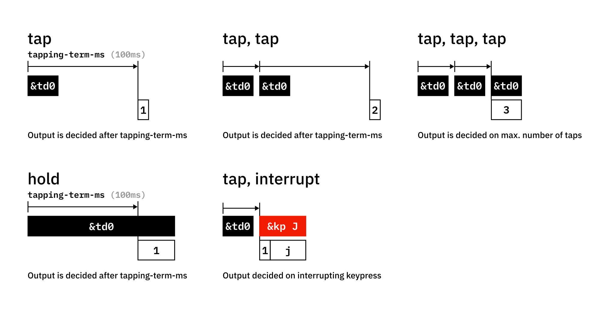

import Tabs from '@theme/Tabs';
import TabItem from '@theme/TabItem';

## Summary

A tap-dance key invokes a different behavior (e.g. `kp`) corresponding to how many times it is pressed. For example, you could configure a tap-dance key that acts as `LSHIFT` if tapped once, or Caps _Lock_ if tapped twice. The expandability of the number of [`bindings`](#bindings) attached to a particular tap-dance is a great way to add more functionality to a single key, especially for keyboards with a limited number of keys. Tap-dances are completely custom, so for every unique tap-dance key,a new tap-dance must be defined in your keymap's `behaviors`.

Tap-dances are designed to resolve immediately when interrupted by another keypress. Meaning, when a keybind is pressed other than any active tap-dances, the tap-dance will activate according to the current value of its counter before the interrupting keybind is registered.

### Configuration

#### `tapping-term-ms`

Defines the maximum elapsed time after the last tap-dance keybind press before a binding is selected from [`bindings`](#bindings). Default value is `200`ms.

#### `bindings`

An array of one or more keybinds. This list can include [any ZMK keycode](../codes/) and any listed ZMK behavior, like [hold-taps](hold-tap.md), or [sticky keys](sticky-key.md). The index of a keybind in the `bindings` array corresponds to the number of times the tap-dance binding is pressed. For example, in the [basic tap-dance counter](#basic-example-counter) shown below, `&kp N2` is the second binding in the array of `bindings`: we then see an output of `2` when the `td0` binding is pressed twice.

The number of bindings in this array also determines the tap-dance's maximum number of keypresses. When a tap-dance reaches its maximum number of keypresses, it will immediately invoke the last behavior in its list of `bindings`, rather than waiting for [`tapping-term-ms`](#tapping-term-ms) to expire before the output is displayed.

#### `trigger-each-binding`

If enabled, the tap-dance will output each behavior on key press. For example, a tap-dance with bindings `1`, `2`, and `3` will output 123 on triple tap.

### Example Usage

<Tabs
defaultValue="basic"
values={[
{label: 'Basic Example: Counter', value: 'basic'},
{label: 'Advanced Example: Mod-Tap Nested inside Tap-Dance', value: 'advanced'},
]}>

<TabItem value="basic">

This example configures a tap-dance named `td0` that outputs the number of times its binding is pressed from 1-3.

```dts title="Basic Tap-Dance Example: Counter"
#include <behaviors.dtsi>
#include <dt-bindings/zmk/keys.h>

/ {
    behaviors {
        td0: tap_dance_0 {
            compatible = "zmk,behavior-tap-dance";
            label = "TAP_DANCE_0";
            #binding-cells = <0>;
            tapping-term-ms = <200>;
            bindings = <&kp N1>, <&kp N2>, <&kp N3>;
        };
    };

    keymap {
        compatible = "zmk,keymap";

        default_layer {
            bindings = <
                &td0
            >;
        };
    };
};
```

The following image describes the behavior of this particular tap-dance.



:::note
Alphanumeric [`key press`](key-press.md) bindings, like those used for `td0`, will release as soon as an interrupting key press occurs. For instance, if a modifier key like `LSHIFT` were to replace the `N1` binding in the last example above, it would remain pressed until `td0`'s binding is released and the output would instead be `J`. Any following alphanumeric key presses would be capitalized as long as `td0` is held down.
:::

</TabItem>

<TabItem value="advanced">

This example configures a mod-tap inside a tap-dance named `td_mt` that outputs `CAPSLOCK` on a single tap, `LSHIFT` on a single press and hold, and `LCTRL` when the tap-dance is pressed twice.

```dts title="Advanced Tap-Dance Example: Nested Mod-Tap"
#include <behaviors.dtsi>
#include <dt-bindings/zmk/keys.h>

/ {
    behaviors {
        td_mt: tap_dance_mod_tap {
            compatible = "zmk,behavior-tap-dance";
            label = "TAP_DANCE_MOD_TAP";
            #binding-cells = <0>;
            tapping-term-ms = <200>;
            bindings = <&mt LSHIFT CAPSLOCK>, <&kp LCTRL>;
        };
    };

    keymap {
        compatible = "zmk,keymap";

        default_layer {
            bindings = <
                &td_mt
            >;
        };
    };
};
```

</TabItem>
</Tabs>
